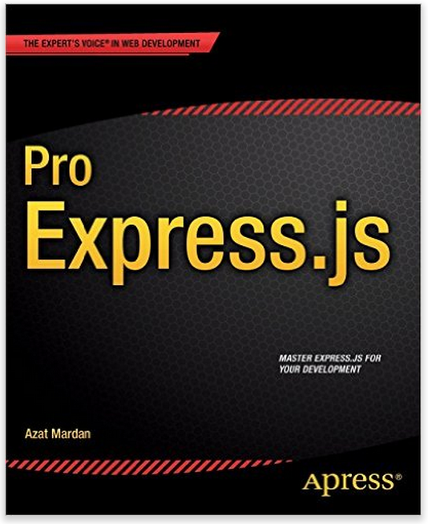

footer: © NodeProgram.com, 2016
slidenumbers: true

# Node Patterns

From Callbacks to Observer

---

# Slides :page_facing_up:

<https://github.com/azat-co/node-patterns>

```
git clone https://github.com/azat-co/node-patterns
```

---

# About Presenter

Azat Mardan


Twitter: @azat_co
Email: hi@azat.co
Blog: webapplog.com

---

# About Presenter

* Work: Technology Fellow at Capital One
* Experience: FDIC, NIH, DocuSign, HackReactor and Storify
* Books: Practical Node.js, Pro Express.js, Express.js API and 8 others
* Teach: NodeProgram.com

---




---


---


FREE: 7+ hours of videos

<http://reactquickly.co>

and
<http://bit.ly/1Umn0pC>


---

# Node Basics

* JavaScript
* Asynchronous + Event Driven
* Non-Blocking I/O

---

# Why Care?

---

* Async code is hard
* Code complexity grows exponentially
* Good code organization is important

---

# JavaScript? :unamused:

---


# Problem 1

How to schedule something in the future?

---

# Callbacks All the Way!

Functions are First-Class Citizens

---

```js
var t = function(){...}
setTimeout(t, 1000)
```

t is a callback

---

# Callback Convention

```js
var fs = require('fs')
var callback = function(error, data){...}
fs.readFile('data.csv', 'utf-8', callback)
```

---

# Conventions

* `error` 1st argument, null if everything is okay
* `data` is the second argument
* `callback` is the last argument


---

# Note

Naming doesn't matter but order matters.

Node.js won't enforce the arguments.

Convention is not a guarantee. It's just a style. — Read documentation or source code.

---

# Problem 2

How to ensure the right sequence? Control flow 😕

---

# Example

HTTP requests to:

1. Get an auth token
1. Fetch data
1. PUT an update

They must be executed in a certain order.

---

```js
... // callback is defined, callOne, callTwo, and callThree are defined
callOne({...}, function(error, data1) {
    if (error) return callback(error, null)
    // work to parse data1 to get auth token
    // fetch the data from the API
    callTwo(data1, function(error, data2) {
        if (error) return callback(error, null)
        // data2 is the response, transform it and make PUT call
        callThree(data2, function(error, data3) {
            //
            if (error) return callback(error, null)
            // parse the response
            callback(null, data3)
        })
    })
})
```

---

# Welcome to callback hell

---

```js
fs.readdir(source, function (err, files) {
  if (err) {
    console.log('Error finding files: ' + err)
  } else {
    files.forEach(function (filename, fileIndex) {
      console.log(filename)
      gm(source + filename).size(function (err, values) {
        if (err) {
          console.log('Error identifying file size: ' + err)
        } else {
          console.log(filename + ' : ' + values)
          aspect = (values.width / values.height)
          widths.forEach(function (width, widthIndex) {
            height = Math.round(width / aspect)
            console.log('resizing ' + filename + 'to ' + height + 'x' + height)
            this.resize(width, height).write(dest + 'w' + width + '_' + filename, function(err) {
              if (err) console.log('Error writing file: ' + err)
            })
          }.bind(this))
        }
      })
    })
  }
}
```

---

# Callback Hell

* Hard to read
* Hard to modify/maintain/enhance
* Easy for devs to make bugs
* Closing parens - 👿

### callbackhell.com

---

# Solutions

* Abstract into named functions (hoisted or variables)
* Use obververs
* Use advanced libraries and techniques

---

# Named Functions

```js
callOne({...}, processResponse1)

function processResponse1(error, data1) {
  callTwo(data1, processResponse2)
}

function processResponse2(error, data2) {
  callThere(data2, processResponse3)
}

function processResponse3(error, data1) {
  ...
}
```

---

# Modular Functions

```js
var processResponse1 = require('./response1.js')
callOne({...}, processResponse1)
```


```js
// response1.js
var processResponse2 = require('./response2.js')
module.exports = function processResponse1(error, data1) {
  callTwo(data1, processResponse2)
}
```

---

```js
// response2.js
var processResponse3 = require('./response3.js')
module.exports = function processResponse2(error, data2) {
  callThere(data2, processResponse3)
}
```

```js
// response3.js
module.exports = function processResponse3(error, data3) {
  ...
}
```

---

# Problem 3

How to modularize code properly?

---

* `module.exports = {...}`
* `module.exports.obj = {...}`
* `exports.obj = {...}`

Note: `exports = {...}` is anti-pattern.

---

# Problem 4

How to modularize dynamic code or where to initialize?

---

# Solution

* `module.exports = function(options) {...}`
* `module.exports.func = function(options) {...}`
* `exports.func = function(options) {...}`


---

# Import

```js
// code A
module.exports = function(options){
  // code B
}
```

When you `require`, code A is run and code B is not.
Code A is run only once, no matter how many times you `require`.
You need to invoke the object to run code B.

---

# Demo

```
node import-main
```

---

# Importing Folders / Plugin Pattern

```js
// main.js
var routes = require('./routes')
```

```js
// routes/index.js
module.exports = {
  users: require('./users.js'),
  accounts: require('./accounts.js')
  ...
}
```

---

# Singletons

* `require`: modules are cached

---

```js
// module.js
var a = 1 // Private
module.exports = {
  b: 2 // Public
}
```


---

```js
// program.js
var m = require('./module')
console.log(m.a) // undefined
console.log(m.b) // 2
m.b ++
require('./main')
```

---


```js
// main.js
var m = require('./module')
console.log(m.b) // 3
```

---

# Demo

```
node main.js
node program.js
```

---


# Problem 5

Modules are cached on based on their resolved filename.

Filename will break the caching

```js
var m = require('./MODULE')
var m = require('./module')
```

Or different paths


---

# Solution

`global`

---


`global.name`

or

`GLOBAL.name`


---

```js
_log = global.console.log
global.console.log = function(){
  var args = arguments
  args[0] = '\033[31m' +args[0] + '\x1b[0m'
  return _log.apply(null, args)
}
```

---

global is powerful... anti-pattern

similar `window.jQuery = jQuery`

use it sparringly


^with a lot of power comes a lot of responsibility

---

# Problem 6: No Classes

How to organize your modular code into classes?

---

# Prototypes

(At least in ES5)

Objects inherit from other objects

Functions are objects too.

---

# Solution

```js
module.exports = function(options) {
  // initialize
  return {
    getUsers: function() {...},
    findUserById: function(){...},
    limit: options.limit || 10,
    // ...
  }
}
```

---

# Solution

`require('util').inherits(child, parent)`

---

## Callbacks Extreme

---

## Node.js Middleware Pattern

---

### What is Middleware

Middleware pattern is a series of processing units connected together, where the output of one unit is the input for the next one. In Node.js, this often means a series of functions in the form:

```js
function(args, next) {
  // ... Run some code
  next(output) // Error or real output
}
```

---

## Continuity

Request is coming from a client and response is sent back to the client.

```
request->middleware1->middleware2->...middlewareN->route->response
```


---

## Express.js Middleware

```js
app.use(function(request, response, next) {
  // ...
  next()
}, function(request, response, next) {
  next()
}, function(request, response, next) {
  next()
})
```

---

# Problem 7

Callbacks are still hard to manage even in modules!

---

# Example

1. Module Job is performing a task.
1. In the main file, we import Job.

How do we specify a callback (some future logic) on the Job's task completion?

---

Maybe:

```js
var job = require('./job.js')(callback)
```

---


What about multiple callbacks?

Not very scalable 😢

---

# Solution

Observer pattern with event emitters!

---

```js
// module.js
var util = require('util')
var Job = function Job() {
  // ...
  this.process = function() {
    // ...
    job.emit('done', { completedOn: new Date() })
  }
}

util.inherits(Job, require('events').EventEmitter)
module.exports = Job
```

^ module

---

```js
// main.js
var Job = require('./module.js')
var job = new Job()

job.on('done', function(details){
  console.log('Job was completed at', details.completedOn)
  job.removeAllListeners()
})

job.process()
```

^main

---

```js
emitter.listeners(eventName)

emitter.on(eventName, listener)

emitter.once(eventName, listener)

emitter.removeListener(eventName, listener)
```

---

## Dependency Injection

```js
// server.js
var app = express()
app.set(port, 3000)
...
app.use(logger('dev'))
...
var boot = require('./routes')(app)
boot({...}, function(){...})
```

---

# Function which returns a function

```js
// routes/index.js
module.exports = function(app){
  return function(options, callback) {
    app.listen(app.get('port'), options, callback)
  }
}
```

---

# There are more patterns!

---

# Further Async

* `async` and `neo-async`
* Promises - not really helping much
* Generators - promising
* Async await - nice wrapper for promises

---


# Further Study

* [`hooks`](https://github.com/bnoguchi/hooks-js)
* [`require-dir`](https://www.npmjs.com/package/require-dir), [`require-directory`](https://www.npmjs.com/package/require-directory) and [`require-all`](https://www.npmjs.com/package/require-all)


---

# Further Reading


<http://amzn.to/21hXxTy>

---

## 30-second Summary

1. Callbacks
1. Observer
1. Singleton
1. Plugins
1. Middleware
1. Bunch of other stuff 💥

---

## THE END

I know it's been a lot 😓 Event Emitters, modules and callbacks are at the core of Node. Know thy patterns!

---

# We lose what we don't use.

---

# Learning Node+React

NodeProgram.com

**What:** Node+Express+MongoDB+React
**Where:** Flatiron School, NYC
**When:** March 12-13, NYC

---

# Rate This Talk 👍

Scale 1-10 (10 is highest)

Anyone below 8?

This is your chance ask a question to make it 10!

---


Q&A ❓🙋 :+1:

Send bugs 🐛 to

<https://github.com/azat-co/node-patterns/issues>

Twitter: @azat_co
Email: hi@azat.co
